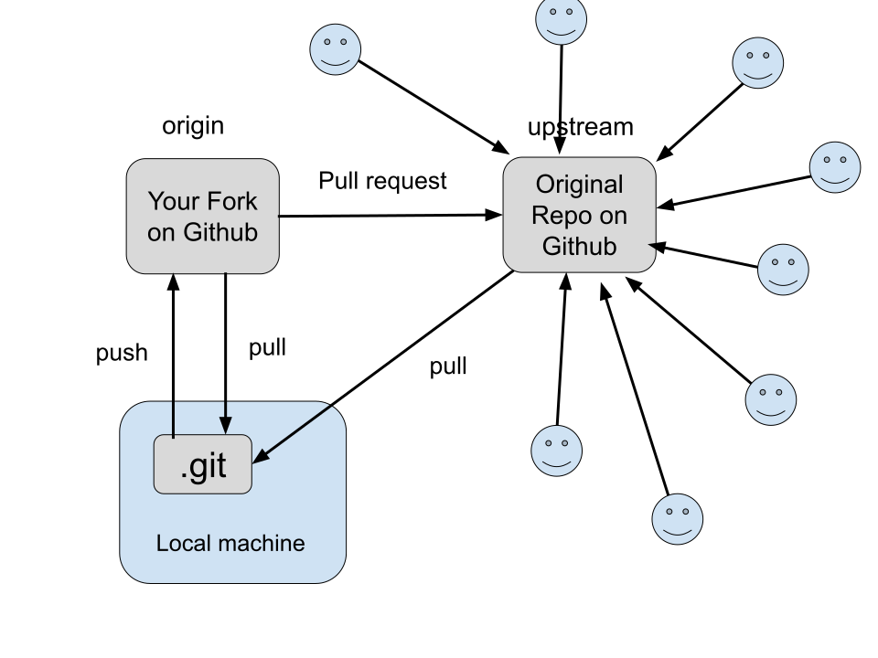
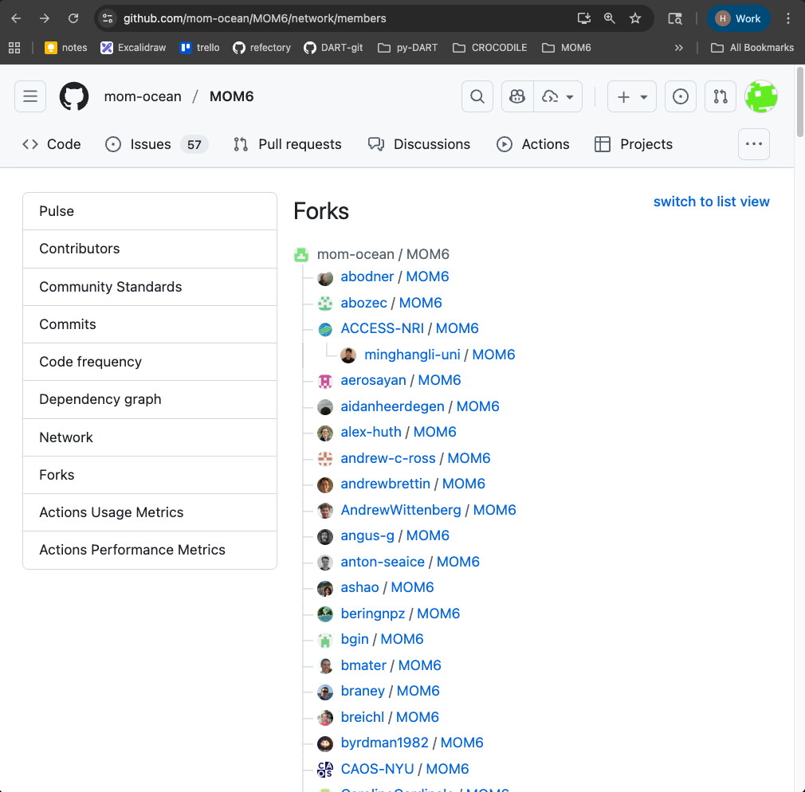
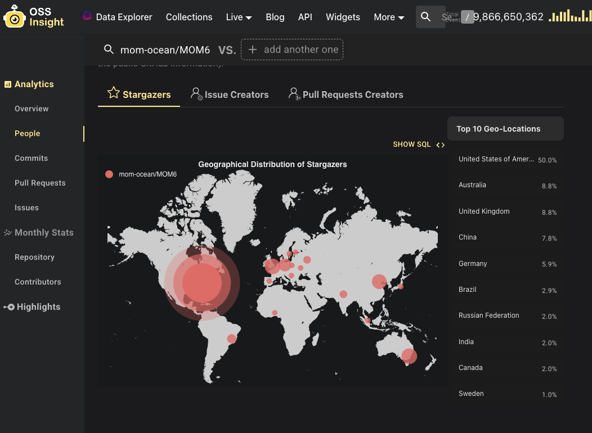

<!-- To build locally: 
cd slides
cat lecture.md participants.md > full.md; npx @marp-team/marp-cli@latest full.md --html --theme ../cake.css >

<!-- _paginate: skip -->
# Git & GitHub


### Version control and collaborative workflows

<!-- This is a speaker note for the first page -->

👩‍🏫 Helen Kershaw
📅 Crocodile Workshop October 2025

---
# Why should I care about version control?

* You can recover previous versions of your project
* Multiple people can work on the same project 
* You can tag a version of code that was used with a particular paper
* Using version control is a great skill to have as you develop code, scripts, and figures 
*  *Anything* that you edit can benefit from version control

---

<div class="note" markdown="1">

Roughly **15,600** developers from more than **1,400** companies have contributed to the Linux kernel since 2005, when the adoption of Git made detailed tracking possible.
The Linux Foundation

</div>

---
# Goals

- Understand Git basics
- Learn about GitHub workflows  
- Practice branching, merging, and pull requests  
  * And creating and fixing *conflicts*

---

# What is Git?

---

<!--
These bullet points are from the commit message from the original revision of git: 
-->

<small>

### "git" can mean anything, depending on your mood.

 * random three-letter combination that is pronounceable, and not
   actually used by any common UNIX command.  The fact that it is a
   mispronounciation of "get" may or may not be relevant.
 * stupid. contemptible and despicable. simple. Take your pick from the
   dictionary of slang.
 * "global information tracker": you're in a good mood, and it actually
   works for you. Angels sing, and a light suddenly fills the room. 
 * "goddamn idiotic truckload of sh*t": when it breaks


https://github.com/git/git/blob/e83c5163316f89bfbde7d9ab23ca2e25604af290/README

</small>

---

# What is Git?


<div class="box-container">
   <div class="box" style="width: 40%;" markdown="1">

- Version control system  
- Tracks **changes** in files  
- Supports collaboration  

   </div>

   <div class="box-no-border" style="width: 40%;" markdown="1" data-marpit-fragment markdown>

    The **commit** is the unit of change

   </div>

</div>

---

# Git concepts

* **Repository** - a place to store all the changes to your project over time
* **Remote** - a repository that is hosted somewhere else, for example on Github

---

# Git concepts

<div data-marpit-fragment markdown="1">

Working with git follows this pattern:

Edit / add / commit

<div>

* Edit your files with your new amazing science (this bit is up to you).
* git add - add a change to the staging area.
* git commit - take a snapshot of the project

<div data-marpit-fragment markdown="1">

The **commit** is what is saved in your git repository

<div>

---

# GitHub

Github is a place to store your git repositories online, with some social media aspects. 
There are other services you can use, for example <span class="highlight">Bitbucket</span> and 
<span class="highlight2">GitLab</span>.

---

# Git concepts

pull / push

  git pull -  get the latest updates from a remote repository
  git push - push your changes to the remote repository

---

# Getting started

Let’s set up your git environment

<div data-marpit-fragment markdown="1">

We’ll set up:

</div>

* The name and email you want to use with git 
* The editor you want to use for writing git commit messages

---

# Setting up your git environment

Set your username and email that you want to be linked with git.  
What you select here will be the ‘author’ information for your commits.

```
git config --global user.name “Margaret Hamilton”
git config --global user.email mhamilton@nasa.gov
```

<div class="note" data-marpit-fragment markdown="1">

**Be aware:** if you do not want your email to be public on GitHub, set this email to your GitHub-provided [noreply](https://docs.github.com/en/account-and-profile/how-tos/setting-up-and-managing-your-personal-account-on-github/managing-email-preferences/setting-your-commit-email-address) email address. 

<div>

---

# Setting up your git environment

Set the editor you want to use for commit messages, vim, nano, emacs, notepad++, vscode,
whatever your favorite editor is.

In this example, I am setting my editor for commit messages to vim. 

`git config --global core.editor vim`

<div class="note" data-marpit-fragment markdown="1">

Note this doesn’t mean you have to edit all code with vim. 
This just means git will open vim when it wants you to write a commit message

</div>

---

# Setting up your git environment

To display what your git settings are use:

`git config --list`

---

# Files every repo 'should' have

<div class="box-container">

<div class="box-no-border">

* README.md
* .gitignore
* LICENSE

</div>

---

# README.md


README.md is the "front page" of your repo on GitHub


<div class="task" data-marpit-fragment markdown markdown="1">

For extra credit:
- find a README.md on GitHub you think is great, find a README.md
- that you think is not-so-great

</div>

---

# Example .gitignore file

<div class="box-container">
   <div class="box" style="width: 40%;" markdown="1">

   ```
   # files for git to ignore
   *.log 
   *.o
   *.mod 
   *.pyc
   cool_program
   ```

   </div>

   <div class="box-no-border" style="width: 40%;" data-marpit-fragment markdown="1">

   It is useful to set up a .gitignore file when you start a project to prevent _accidentally_ adding binary files to your repository

   </div>
</div>

<div data-marpit-fragment markdown="1">

This .gitignore file means that in this repository, any files that end in _.log_, _.o_, _.mod_, or _.pyc_ or called _cool_program_ will not be tracked. This makes life easier because you can add whole directories without worrying about adding files you don’t want to track.

</div>

---

# License choice

<div class="note">
Choice of license is out-of-scope for this talk, but checkout these resources:

- [opensouce.guide](https://opensource.guide/legal/#which-open-source-license-is-appropriate-for-my-project)
- GitHub's [choosealicense.com](https://choosealicense.com/)

</div>


---
<!-- footer: Exercise 1 -->
# Exercise 1: create a repository

<div data-marpit-fragment markdown markdown="1">

```
mkdir my-first-repo   
cd my-first-repo      
```
</div>

<div data-marpit-fragment markdown markdown="1">

Create your repository with:
`git init`

</div>

<div data-marpit-fragment markdown markdown="1">

Creates a _hidden_ directory (_.git_) which contains all of the internal data:
commits, branches, tags, configuration, and the object database.

</div>
  
<div data-marpit-fragment markdown markdown="1">

The files and directories you see outside of .git/ (your source code, docs, etc.)
are your **working tree**.

</div>

---


Check the status of your repository:
`git status`

---

Create a .gitignore file.
Add your .gitignore file to your repository. 
`git add .gitignore`

Check the status of your repository:
`git status`


---

Commit your added file

`git commit -m "initial commit"`

-m means message 

Take a look at the log

`git log`
`git log --oneline`


---
<!-- footer: "" -->
# Writing good commit messages

One line short summary of the change

More detail if needed on why you changed what

<div data-marpit-fragment markdown markdown="1">

```
Place ring in Mount Doom

Ring is destroyed, Sauron loses his power forever. All he created collapses, 
the Nazgûl perish, and his armies are thrown into such disarray that 
Aragorn's forces emerge victorious.
```
</div>

---

# Viewing the status of your repository

To see which files have been edited, which have been added to the staging area, and any files that are not being tracked by git, use 

`git status`

---

# Undoing changes

Checkout an earlier version of a file

`git checkout hash filename`

For example:

`git checkout 73eba0ddb Money`

---

# Undoing changes


The output from `git status` gives the instructions for unstaging and 
discarding changes:

---
# Working with remote repositories

* A **remote** is a version of your repository that is hosted on the internet or network somewhere.  
* You can have multiple remotes for a repository.
* The default remote is called **origin**.

---



---
<!-- footer: "" -->
# Working with remote repositories

**Fork** vs. _Clone_

<div data-marpit-fragment markdown="1">

**Cloning** is the initial download of remote repository to your machine.

 `git clone repository-address` downloads the code to your machine.  You can use git locally, but if you want to push your changes to GitHub you will need permission to write to the repository on github.

</div>

<div data-marpit-fragment markdown="1" >

Multiple people can work on the same repository if they have **permission to write** to the repository on GitHub.

</div>

<div data-marpit-fragment>

_Forking_ is creating your own version of the code on GitHub.  You can now change the code and push those commits to GitHub.
You make a _pull request_ to suggest your changes be merged into the original repository.

---
# Famous Forks

The CROCODILE version of MOM6:

https://github.com/CROCODILE-CESM/MOM6

is a fork of the NCAR MOM6 repository:

https://github.com/NCAR/MOM6

which is a fork of the original MOM6 repository:

https://github.com/mom-ocean/MOM6

---

<!-- _footer: https://github.com/mom-ocean/MOM6/network/members -->



---

<!-- _footer: https://ossinsight.io/analyze/mom-ocean/MOM6#people -->



---
<!-- footer: Exercise 2 -->
# Exercise 2: Clone a repository from GitHub

Explore a repository on GitHub, here are a couple of examples 

https://github.com/hkershaw-brown/poems
https://github.com/ESCOMP/CESM

Have a look at the commits and the contributors. 

---

Clone the repository to your machine

`git clone https://github.com/hkershaw-brown/poems.git`

Checkout an earlier version of the repository `git checkout #hash`

Checkout a branch

<div class="task" data-marpit-fragment markdown markdown="1">

What is the difference between a **commit** and a _branch_?

</div>

---
<!-- footer: "" -->

# Working with remote repositories

To see all the remote repositories:

`git remote -v`

To see the remote for the origin repository 
`git remote show origin`

To get changes from the remote repository and apply them to your branch
`git pull`

<div class="task" markdown="1">
  
  What is the difference between `git fetch` and `git pull`?

</div>

---
# Working with remote repositories

Storing local changes while you pull from a remote repository
Sometimes the changes you pull from a remote repository will conflict with your local changes. You can stash your local changes, pull the new changes from the remote repository, then pop your changes back.

```
git stash
git pull
git stash pop
```
---

# Working with remote repositories

Here is an example message when pulling changes conflicts with your local changes

---

<!-- footer: Exercise 3 -->
# Exercise 3: Make a pull request

Fork the [CROCODILE-CESM/git-lecture-2025](https://github.com/CROCODILE-CESM/git-lecture-2025) repository on GitHub.

Clone your forked repository to your machine.

`git clone https://github.com/YOUR_USERNAME/git-lecture-2025.git`

Create a new branch for your changes.

```
cd git-lecture-2025
git checkout -b participant-USERNAME
```

<div class="note" data-marpit-fragment markdown markdown="1">

Replace **USERNAME** with your GitHub username

</div>

---

### Make things <span style="color:rgb(255, 123, 0)">better</span>!

Make a **change** to the code

- Add your name to the participants.md file in the repository.
- Fix any typos in lecture.md

Add and **commit** your changes.

---

Submit a pull request to the [CROCODILE-CESM/git-lecture-2025](https://github.com/CROCODILE-CESM/git-lecture-2025).

<div class="task" markdown="1">

- Add your name to the participants.md file in the repository.
- Fix any typos in lecture.md

</div>

<p>

<div class="note" data-marpit-fragment markdown markdown="1">

The slides will be updated during the workshop.

</div>

---
<!-- footer: Homework -->
# Homework: Putting your repository on Github

You can use the repository from Exercise 1 or use your own code if you have some. For your own code, think about whether you want the repository to be public or private. You can share private repositories with other people if you choose. Public repositories are visible to the world.


<div class="task" data-marpit-fragment markdown markdown="1">
Extra credit fun with a friend:
Partner up with someone and invite them to be a collaborator on your repository.  What happens when you both make changes to the same file.  What happens when you try and push these changes to the repository.  Can you sort out any conflicts?
</div>

---
<!-- footer: "" -->
# Next steps

Once you are comfortable with git and *tracking changes* through time, you may want to do some of the following: 

- Use branches to work on new features
- Use tags to identify versions of your code
- Make DOIs for your code on GitHub for your published papers
- Think about what license you should choose for your code
- Submit *pull requests* to contribute to other projects
- Use GitHub issues for your code todo lists
- Find your favorite tools for working with Git
- Share your *wisdom* with your labmates

---
<!-- footer: "" -->
# Homework: Think about the workflow you want to use

Think about how you want to use git and GitHub in your own work.  Here are some questions to consider:

* How many people work on your code?
* Is issue tracking useful for you?
* Do you want to use branches for new features? Or just work on the main branch?
* Do you want to use pull requests for code review?
* What would you put in a contributors guide?

<div class="note" data-marpit-fragment markdown markdown="1">

Atlassian has a good guide to [choosing a workflow](https://www.atlassian.com/git/tutorials/comparing-workflows).
GitHub has a guide to [GitHub flow](https://docs.github.com/en/get-started/quickstart/github-flow).

</div>


---


# Have Questions? Need Help?

